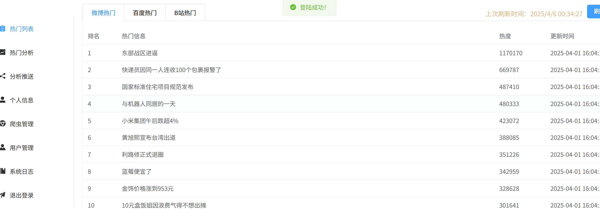

## 基于scrapy爬虫，使用django和vue3搭建的热门信息监测系统。
### 项目介绍
从B站、微博、百度在内的多个网络媒体平台上收集信息，为热门信息提供高效便捷的监测。
### 系统截图

### 系统启动
1. 启动mysql服务
```sh
sudo systemctl start mysql
```
2.安装python3的依赖包
```sh
pip install -r requirements.txt
```
3.安装vue3的依赖包
```sh
pnpm install
```
4.在django/setttings.py中配置数据库和发送邮件的设置,以下是一个示例：
```sh
'NAME': 'xxx'
'USER': 'xxx'
'PASSWORD': 'xxx'
'HOST': '127.0.0.1'
'PORT': '3306'
```
```sh
EMAIL_BACKEND = 'django.core.mail.backends.smtp.EmailBackend'
EMAIL_HOST = 'xxx'
EMAIL_PORT = 25
EMAIL_USE_TLS = True
EMAIL_USE_SSL = False
EMAIL_HOST_USER = 'xxx'
EMAIL_HOST_PASSWORD = 'xxx'
```
5.在scrapy/main.py中配置相同的数据库，以下是一个示例：
```sh
'host'='127.0.0.1'
'port'=3306
'user'='xxx'
'password'='xxx'
'db'='xxx'
```
6.在backend目录下运行：
```sh
python manage.py runserver
```
7.在scrapy目录下运行：
```sh
python main.py
```
8.在frontend目录下运行：
```sh
pnpm run
```
